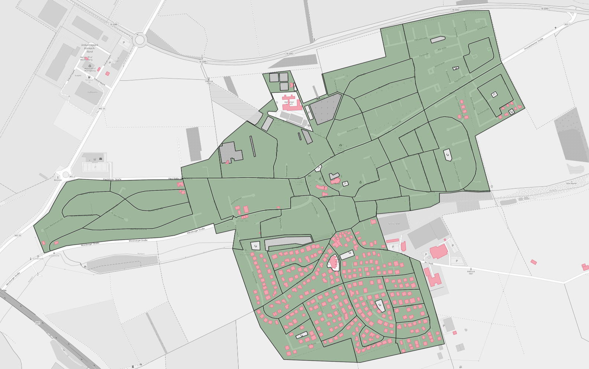
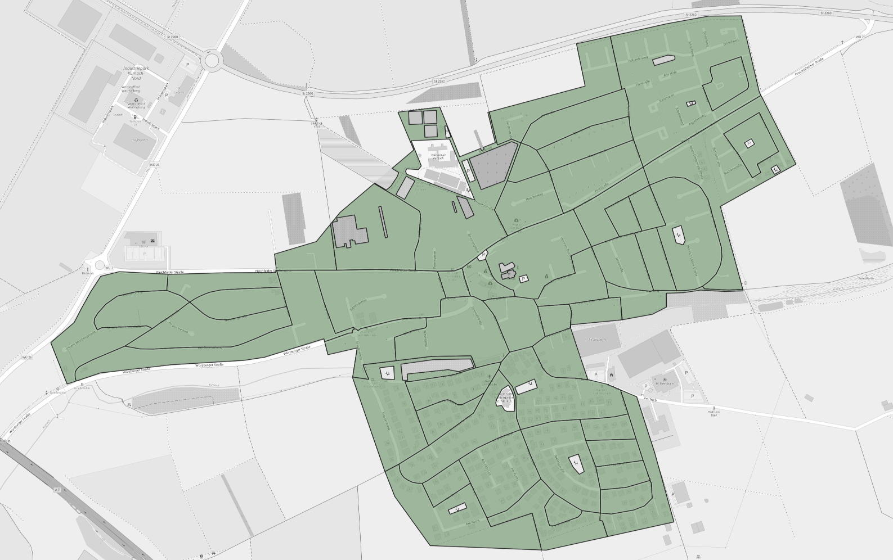

# [MapRoulette: Residential land use areas with too few buildings](https://maproulette.org/browse/projects/41947)

OpenStreetMap maps land use, the primary use of a land area by humans.
Typical uses are residential, commercial, industrial, and so on. See the
[OpenStreetMap wiki on land use](https://wiki.openstreetmap.org/wiki/Key:landuse)
for details.

Some land-use types imply that buildings should be found on that land. A
residential area should have houses.

This project looks at residential areas in Germany in OpenStreetMap which
contain suspiciously few buildings. These are fed as mapping tasks into
[MapRoulette](https://maproulette.org/browse/projects/41947), a
micro-tasking platform for OpenStreetMap contributors, where they can improve
the map by adding the buildings and other details, one small task at a time.


## Related projects

* In the
  [first version](https://github.com/hfs/landuse_without_buildings/releases/tag/1.0.0)
  of this project, residential land use areas without *any* buildings were
  mapped and over 350,000 buildings were added this way by 175 contributors.
* [MapRoulette: Unmapped residential areas in Germany](https://github.com/hfs/unmapped-census)
* [MapRoulette: Buildings without landuse](https://github.com/hfs/buildings_without_landuse)


## Processing steps

### [01_download.sh](01_download.sh) – Download data

Download a recent
[OpenStreetMap data dump for Germany from Geofabrik](https://download.geofabrik.de/europe/germany.html)
as input data.

### [02_createdb.sh](02_createdb.sh) – Create database

Create the PostGIS database where the data analysis will happen.

### [03_import_osm.sh](03_import_osm.sh) – Import OSM data into the database

Filter the OpenStreetMap data for residential and other relevant land uses,
buildings and streets. OpenStreetMap contains all kinds of geospatial data,
e.g. roads, shops and schools. We are only interested in areas where people
live like residential areas or buildings. The filter is defined in
[residential_and_buildings.lua](residential_and_buildings.lua).

### [04_analyze.sh](04_analyze.sh) – Intersect the data sets

Calculate the area in m² of land use areas and of buildings. Intersect the
geometries to find which buildings are inside which land use area. Calculate
the sum of areas of all buildings in one land use area, to get the proportion
how much of a land use area is covered by buildings.

The assumption is that at least X % of residential land use areas is covered by
buildings.

The input data looks like this:



The orange and purple areas are residential land use areas. Light red are
buildings. Orange areas are land use areas which are covered less than 5 % by
buildings. They are processed further to eventually become challenge tasks.
Purple areas contain more than 5 % buildings and are not further analyzed in
this challenge.



Many land use areas are very large and can contain tens or hundreds of
buildings. It’s very daunting for mappers having to map so many buildings just
for one task. That’s why the land use areas are cut up by the roads crossing
them.

For each block, the coverage by buildings is calculated again. In the map
image, red blocks contain zero buildings, orange blocks less than 5 % and
yellow ones 5 % or more. Only the blocks with up to 5 % building coverage
become tasks and those with more are discarded.

### [05_export_csv.sh](05_export_csv.sh) – CSV export

This is an export for people who don’t want to use MapRoulette, but check one
county or state systematically.

### [06_export_geojson.sh](06_export_geojson.sh) – GeoJSON export

Export the land use polygon as geometry in GeoJSON format that can be uploaded
in MapRoulette.

Each one of the polygons is presented as mapping task to the MapRoulette
contributors. They will use satellite/aerial imagery to see the buildings and
then draw their outlines.


### [07_upload_results.sh](07_upload_results.sh) – Upload output

This is a convenience script for myself to upload updated versions of the
output files as GitHub gist, from where they will be pulled by MapRoulette. The
data should be refreshed every few weeks, to account for changes done by other
mappers outside of MapRoulette. If the data gets stale, it becomes frustrating
for MapRoulette users to get assigned tasks where nothing is left to do.

### [08_maproulette_refresh.py](08_maproulette_refresh.py) – Update MapRoulette challenges

Convenience script to refresh the MapRoulette challenge from the uploaded data.

### [09_challenge_status.py](09_challenge_status.py) – Export challenge status as CSV

Export data about completed tasks as CSV for further evaluation of the challenge progress.


## How to run the analysis yourself

You can run the analysis yourself, e.g. for newer data for a different country
or if you want to modify the criteria.

The processing for Germany requires about 100 GB of temporary disk space and 2
hours of computation time. Having the database on an SSD is highly recommended,
as the processing takes several times that on a HDD.

### Using Docker and Docker Compose

This is the easier way if you already have [Docker](https://www.docker.com/)
and don’t want to bother with the dependencies.

```
docker-compose up
```

The output files are `data/*.geojson`.

### Running manually

Install PostgreSQL, PostGIS ≥ 3.1, `osm2pgsql`, `osmconvert` and `osmfilter`
(package `osmctools`) and `npm`.

Install [geojson-rewind](https://github.com/mapbox/geojson-rewind)
using `npm install -g @mapbox/geojson-rewind`.

Edit `env.sh` to set the PostgreSQL credentials.

Run `./run.sh` to execute all processing steps, or call the single scripts to
run specific steps.


## License

The source code of this project is licensed under the terms of the
[MIT license](LICENSE).

As the output data is a Derivative Work of OpenStreetMap data, is has to be
licensed under [ODbL](https://opendatacommons.org/licenses/odbl/). Please refer
to the [OSM Copyright](https://www.openstreetmap.org/copyright/) page and the
information linked there.

The map images in the documentation are `Ⓒ OpenStreetMap contributors`.
