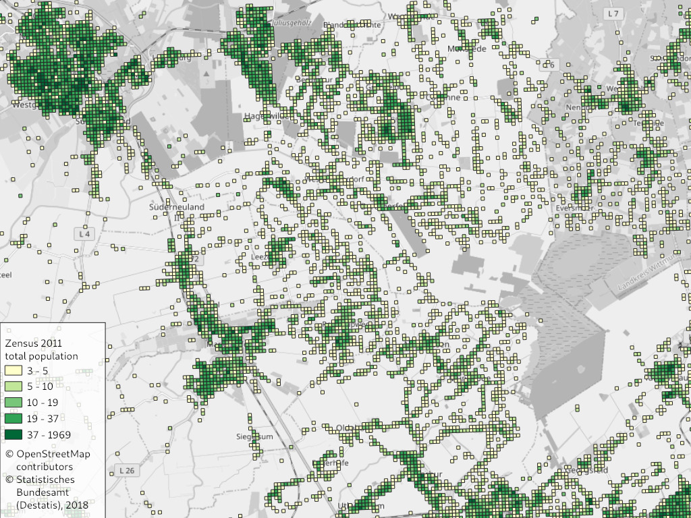
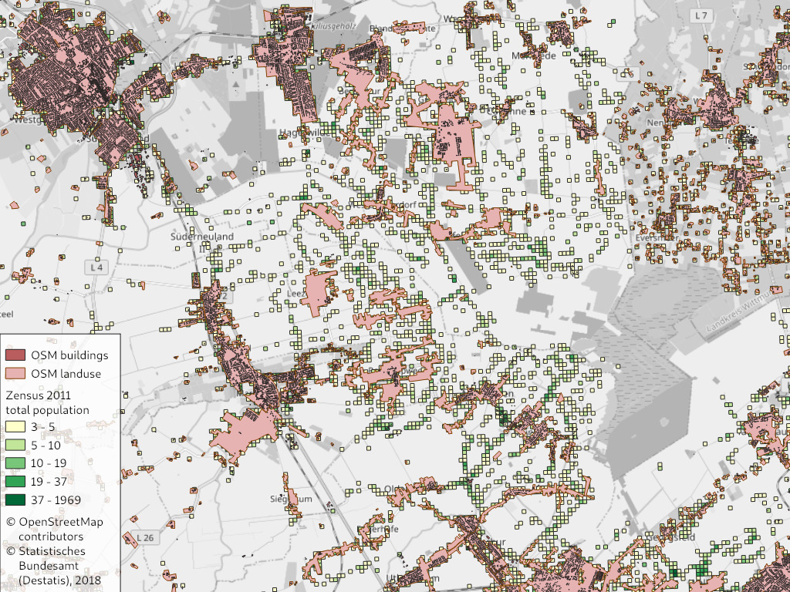
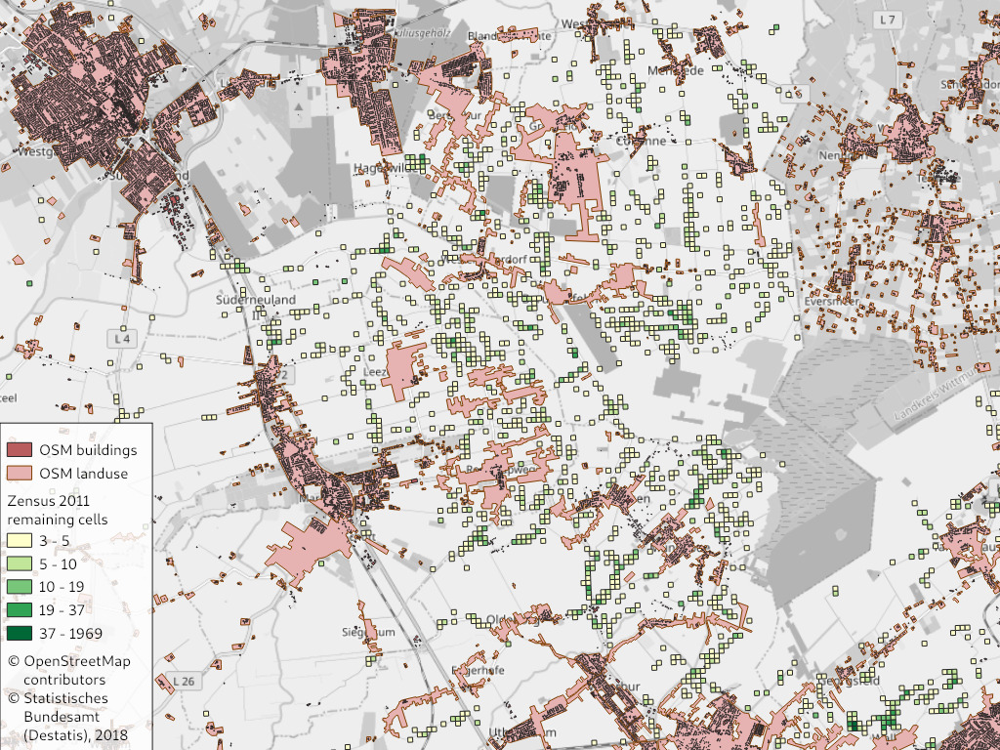
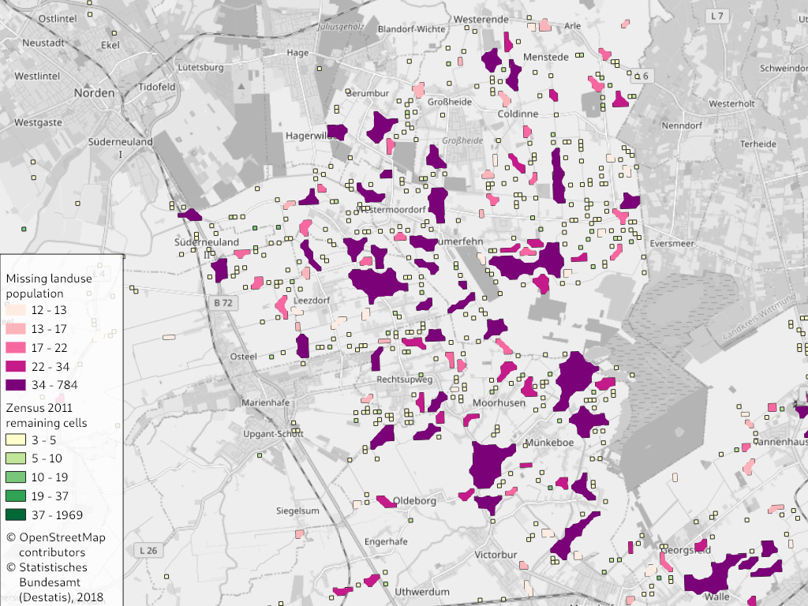
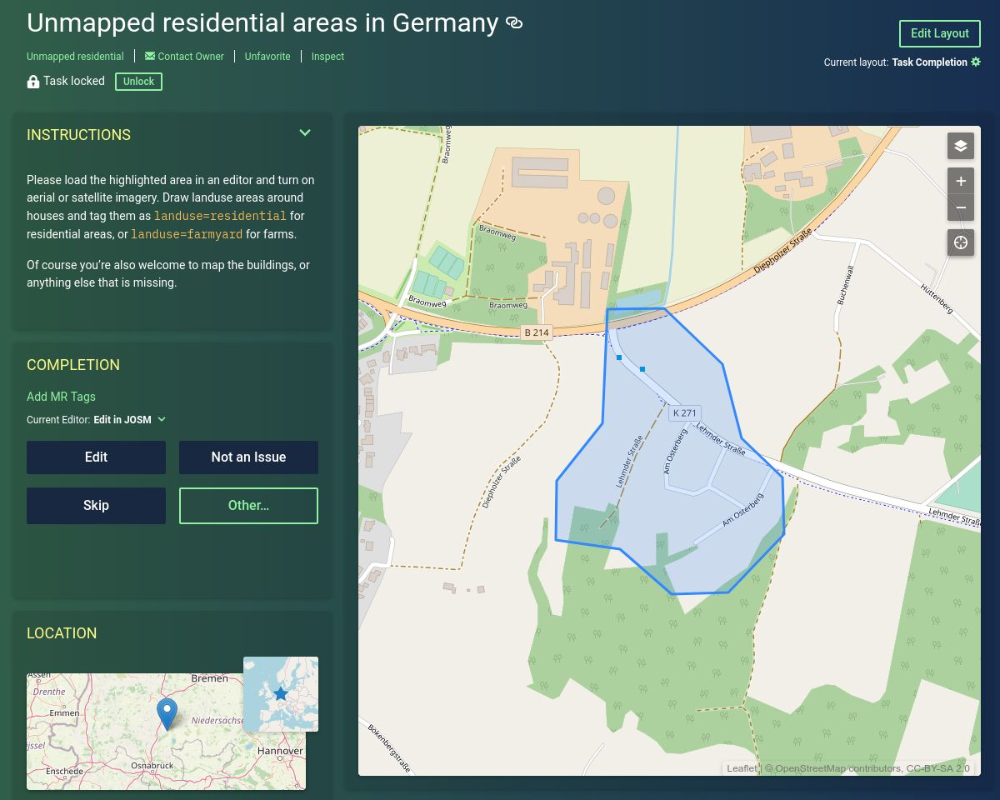

# [Maproulette: Unmapped residential areas in Germany](https://maproulette.org/browse/challenges/14893)

Population data for  Germany is available on a high-resolution 100 m grid from
the census 2011. By comparing this data to residential landuse areas and
buildings, one can find areas in Germany that are not yet mapped in
[OpenStreetMap](https://www.openstreetmap.org/). These are mostly small
villages and settlements.

The identified unmapped areas are fed as mapping tasks into
[Maproulette](https://maproulette.org/browse/challenges/14893), a micro-tasking
platform for OpenStreetMap contributors, where they can improve the map one
small issue at a time.


## Data sources

1. German Census 2011:
   [Population on a 100 m grid](https://www.zensus2011.de/DE/Home/Aktuelles/DemografischeGrunddaten.html)
   (“Demographie im 100 Meter-Gitter im CSV-Format”). Keep in mind that the
   data is from 2011 and things have changed since then. E.g. new houses built
   since then are not taken into account. But if some place was inhabited in
   2011 it is very likely that it is still inhabited today.
2. [OpenStreetMap dump for Germany from Geofabrik](https://download.geofabrik.de/europe/germany.html)


## Processing steps

### [01_download.sh](01_download.sh) – Download data

Download the input data.

### [02_createdb.sh](02_createdb.sh) – Create database

Create the PostGIS database where the data analysis will happen.

### [03_import_census.sh](03_import_census.sh) – Import census data

Filter the census data for grid cells with population > 0. Then import the data
into the PostGIS database.

The data looks like this:



### [04_import_osm.sh](04_import_osm.sh) – Import OSM data

Filter the OpenStreetMap data for residential and other relevant landuses and
buildings. OpenStreetMap contains all kinds of geospatial data, e.g. roads,
shops and schools. We are only interested in areas where people live like
residential areas or buildings. Some other types of places need to be included
like farms, allotments, nursery homes, hospitals or prisons, where people may
reside permanently.

On this map you can see how these areas overlap with the census cells. We are
interested in the cells which are not yet covered by residential areas.



### [05_analyze.sh](05_analyze.sh) – Intersect the data sets

Now we filter the census cells to include only those that are not covered or
touched in any way by the relevant OSM objects. These identify areas that
should be looked at for sure.



Finally identify clusters of touching squares and merge them into single
polygons to identify one connected are that should become a task.

The polygons are filtered once more to include only those which are larger than
one cell and contain at least 12 people. This is done to avoid false positives
and to work on the most urgent cases first.

This map shows how the final output looks like:



Each one of the polygons is then presented as mapping task to the Maproulette
contributors. The outline indicates the rough area to check, but users will
then use satellite/aerial imagery to get the precise outline.




## How to run the analysis yourself

You can run the analysis yourself, e.g. for newer data or if you want to modify
the criteria.

The processing requires about 100 GB of temporary disk space and 1 hour of
computation time.

### Using Docker and Docker Compose

This is the easier way if you already have [Docker](https://www.docker.com/)
and don’t want to bother with the dependencies.

```
docker-compose up
```

The output file is `data/unmapped_census_fixed.geojson`.

### Running manually

Install PostgreSQL, PostGIS, `osm2pgsql`, `osmconvert` and `osmfilter` (package
`osmctools`) and `npm`.

Install [geojson-rewind](https://github.com/mapbox/geojson-rewind)
using `npm install -g @mapbox/geojson-rewind`.

Edit `env.sh` to set the PostgreSQL credentials.

Run `./run.sh` to execute all processing steps, or call the single scripts to
run specific steps.


## License

The source code of this project is licensed under the terms of the
[MIT license](LICENSE).

The census data may be used for derivative works, if you mention the source
“Statistisches Bundesamt (www.destatis.de)”. See their
[imprint](https://www.zensus2011.de/DE/Service/Impressum/impressum_node.html)
for details.

As the output data is a Derivative Work of OpenStreetMap data, is has to be
licensed under [ODbL](https://opendatacommons.org/licenses/odbl/). Please refer
to the [OSM Copyright](https://www.openstreetmap.org/copyright/) page and the
information linked there.
