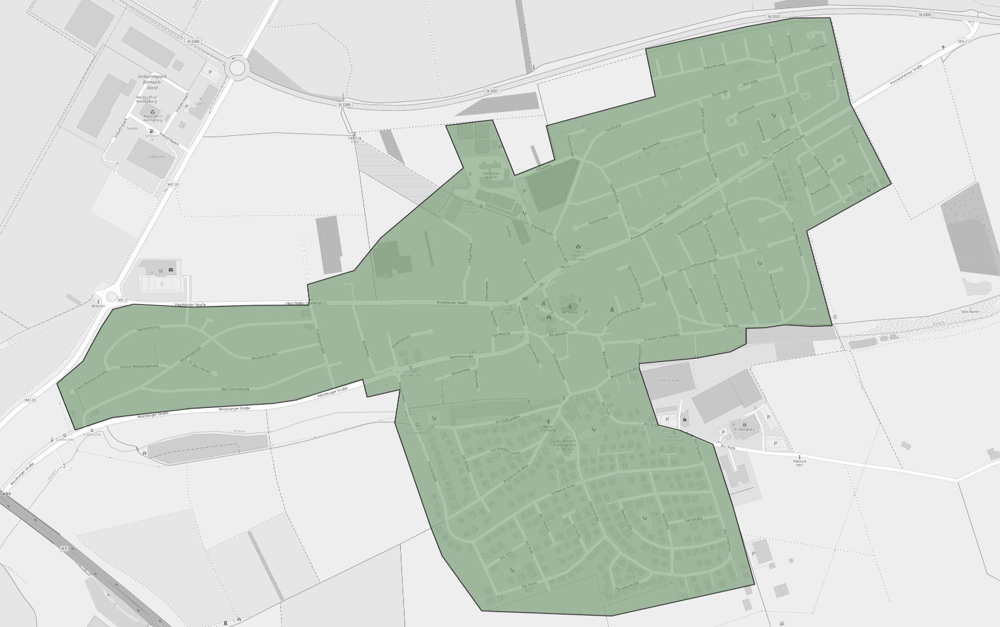
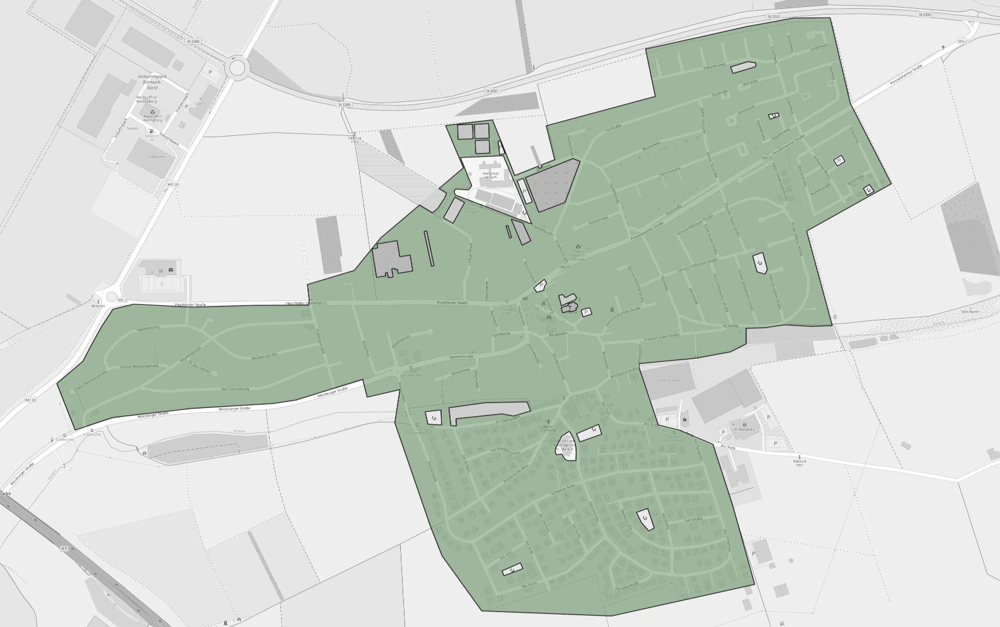
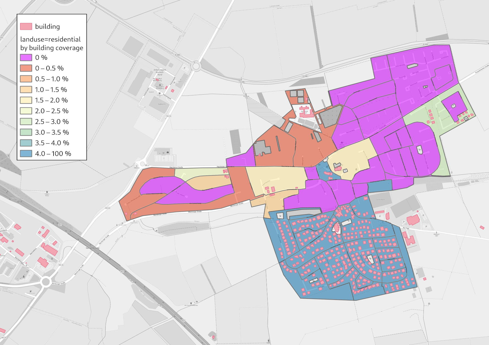
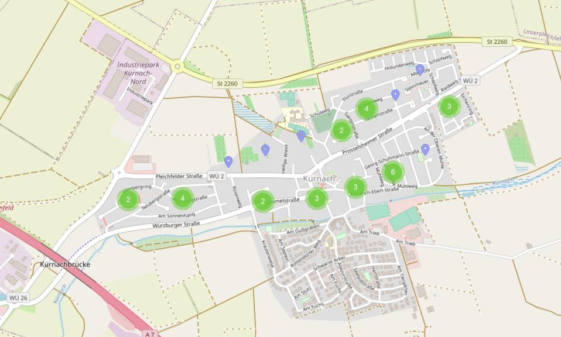
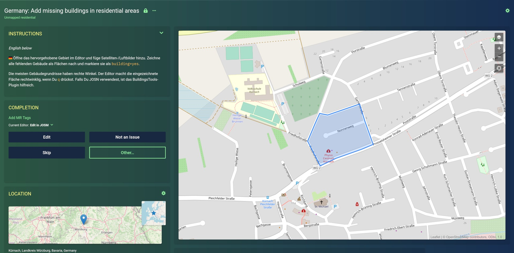

# [MapRoulette: Residential land use areas with too few buildings](https://maproulette.org/browse/projects/41947)

OpenStreetMap maps land use, the primary use of a land area by humans.
Typical uses are residential, commercial, industrial, and so on. See the
[OpenStreetMap wiki on land use](https://wiki.openstreetmap.org/wiki/Key:landuse)
for details.

Some land-use types imply that buildings should be found on that land. A
residential area should have houses.

This project looks at residential areas in Germany in OpenStreetMap which
contain suspiciously few buildings. These are fed as mapping tasks into
[MapRoulette](https://maproulette.org/browse/projects/41947), a
micro-tasking platform for OpenStreetMap contributors, where they can improve
the map by adding the buildings and other details, one small task at a time.


## Related projects

* In the
  [first version](https://github.com/hfs/landuse_without_buildings/releases/tag/1.0.0)
  of this project, residential land use areas without *any* buildings were
  mapped and over 360,000 buildings were added this way by 175 contributors. See the blog post
  [Mapping 360,000 buildings in Germany](https://www.openstreetmap.org/user/hfs/diary/398014)
  about the results.
* [MapRoulette: Unmapped residential areas in Germany](https://github.com/hfs/unmapped-census)
* [MapRoulette: Buildings without landuse](https://github.com/hfs/buildings_without_landuse)


## Processing steps

### [01_download.sh](01_download.sh) – Download data

Download a recent
[OpenStreetMap data dump for Germany from Geofabrik](https://download.geofabrik.de/europe/germany.html)
as input data.

### [02_createdb.sh](02_createdb.sh) – Create database

Create the PostGIS database where the data analysis will happen.

### [03_import_osm.sh](03_import_osm.sh) – Import OSM data into the database

Filter the OpenStreetMap data for residential and other relevant land uses,
buildings and streets. OpenStreetMap contains all kinds of geospatial data,
e.g. roads, shops and schools. We are only interested in areas where people
live like residential areas or buildings. The filter is defined in
[residential_and_buildings.lua](residential_and_buildings.lua).

### [04_analyze.sh](04_analyze.sh) – Intersect the data sets

Calculate the area in m² of land use areas and of buildings. Intersect the
geometries to find which buildings are inside which land use area. Calculate
the sum of areas of all buildings in one land use area, to get the proportion
how much of a land use area is covered by buildings.

The assumption is that at least X % of residential land use areas is covered by
buildings.

The processing starts from the residential land use areas:



A lot of residential land use areas in OpenStreetMap are overlapped by other
areas. You can often find one residential polygon encompassing a whole village
or city district which is then overlapped by school grounds, parks, sports
areas and so on. As the latter type of areas won't contain residential houses,
they should be excluded from the analysis.

After subtracting the unwanted areas it may look like this:



The next step is to split the large areas into smaller parts. Some part of the
area may already be mapped with buildings while they are still missing in other
parts. Also the mapping tasks should be small and quick to solve and not
contain hundreds of buildings to draw.

Overlay the street network and split the land use areas by the street.

This step can create a lot of small, narrow polygons, especially between
separated lanes of streets that are mapped as two lines in OpenStreetMap. These
narrow polygons are detected and merged with their neighbors.


Now overlay the buildings that are already mapped:


For each block, the area covered by buildings is calculated.



Blocks in pink don’t contain any buildings. Blocks from orange to green contain
a few buildings that cover up to 4 %. Blue blocks contain 4 % or more
buildings.

All blocks with 0 % to 4 % building coverage become tasks in MapRoulette.


### [05_fetch_old_challenges.py](05_fetch_old_challenges.py)

A similar challenge was already run with
[v2](https://github.com/hfs/landuse_without_buildings/tree/2.2.0)
of the code. Mappers should not presented with tasks that were aready dealt
with in the previous run by either fixing them or marking them as invalid.

The polygons and results of the previous run are fetched from MapRoulette.


### [06_import_old_challenges.sh](06_import_old_challenges.sh)

Import the old challenges into the same database.


### [07_subtract_old_challenges.sh](07_subtract_old_challenges.sh)

Remove any tasks were already touched in a previous version and marked as fixed
or invalid.


### [08_export_csv.sh](08_export_csv.sh) – CSV export

This is an export for people who don’t want to use MapRoulette, but check one
county or state systematically.

### [09_export_geojson.sh](09_export_geojson.sh) – GeoJSON export

Export the land use polygon as geometry in GeoJSON format that can be uploaded
in MapRoulette.

Each one of the polygons is presented as mapping task to the MapRoulette
contributors. They will use satellite/aerial imagery to see the buildings and
then draw their outlines.



As you can see the polygons shown above become tasks in MapRoulette.



When selecting a single tasks the mapper can open the area in an editor to map
the buildings, or can skip the task or mark it as invalid.


### [10_upload_results.sh](10_upload_results.sh) – Upload output

This is a convenience script for myself to upload updated versions of the
output files as GitHub gist, from where they will be pulled by MapRoulette. The
data should be refreshed every few weeks, to account for changes done by other
mappers outside of MapRoulette. If the data gets stale, it becomes frustrating
for MapRoulette users to get assigned tasks where nothing is left to do.

### [11_maproulette_refresh.py](11_maproulette_refresh.py) – Update MapRoulette challenges

Convenience script to refresh the MapRoulette challenge from the uploaded data.

### [12_challenge_status.py](12_challenge_status.py) – Export challenge status

Export data about completed tasks as in formatting suitable for the
OpenStreetMap forum.


## How to run the analysis yourself

You can run the analysis yourself, e.g. for newer data for a different country
or if you want to modify the criteria.

The processing for Germany requires about 100 GB of temporary disk space and
2.5 hours of computation time. Having the database on an SSD is highly
recommended, as the processing is several times slower on a HDD.

### Using Docker and Docker Compose

This is the easier way if you already have [Docker](https://www.docker.com/)
and don’t want to bother with the dependencies.

```
docker-compose up
```

The output files are `data/*.geojson`.

### Running manually

Install PostgreSQL, PostGIS ≥ 3.1, `osm2pgsql`, `osmconvert`. `osmfilter`
(package `osmctools`), `ogr2ogr` (package `gdal-bin`) and `npm`.

Install [geojson-rewind](https://github.com/mapbox/geojson-rewind) using `npm
install -g @mapbox/geojson-rewind`.

Edit `env.sh` to set the PostgreSQL credentials.

Run `./run.sh` to execute all processing steps, or call the single scripts to
run specific steps.


## License

The source code of this project is licensed under the terms of the
[MIT license](LICENSE).

As the output data is a Derivative Work of OpenStreetMap data, is has to be
licensed under [ODbL](https://opendatacommons.org/licenses/odbl/). Please refer
to the [OSM Copyright](https://www.openstreetmap.org/copyright/) page and the
information linked there.

The map images in the documentation are `Ⓒ OpenStreetMap contributors`.
